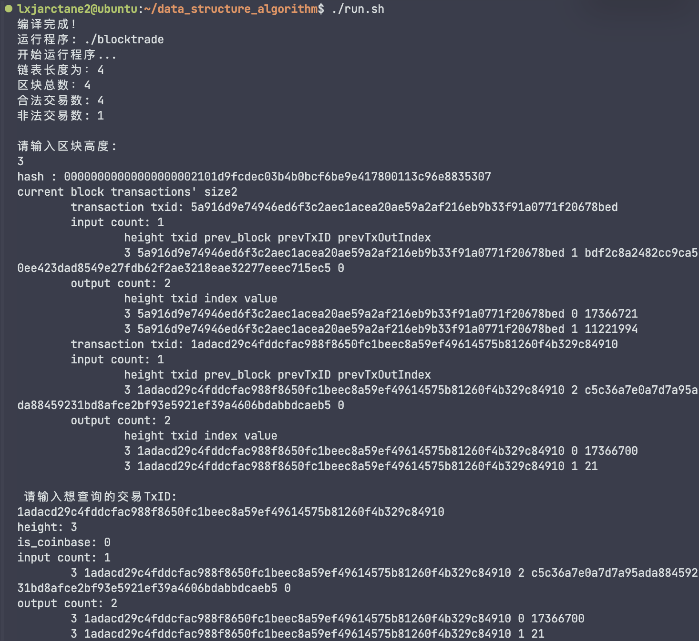

## 区块的链

#### 运行系统（虚拟机）
- 操作系统：Ubuntu 22.04
- 编译器：g++ 9.3.0
- 内存：8GB
- 处理器：Intel(R) Core(TM) i5-8250U CPU @ 1.60GHz

### 运行指南
1.编译：运行compile.sh 脚本
2.运行：运行run.sh 脚本
3.切记不要删除文件夹下的external文件夹，里面是我的外部库

##### 提示：blocktrade程序只用于测试demo文件夹内的csv，经测试运行成功

### blocktrade.cpp 程序说明
程序使用github上的csv-parser库进行读取csv文件数据，github链接为https://github.com/vincentlaucsb/csv-parser

首先对于四个部分，block区块使用了双向循环链表进行存储，block结构体里面还存储了对应高度的transaction

transaction结构体里面存储了每个交易使用的input和output信息

注意，我的input和output都是先存入大的数组，然后再分到对应的transaction里面的，然后transaction存入对应的block。所以整体上来说，我创建了一个广义表，每个block里面存储了对应高度的transaction，每个transaction里面存储了对应的input和output信息。
```
struct transaction
{
    int height;
    string txid;
    int is_coinbase;
    input ip[IO_MAX_NUM];
    output op[IO_MAX_NUM];
    int input_count;
    int output_count;
    bool is_legal;
    output *used_ops_ptr[IO_MAX_NUM];
    int ptr_count;
};

struct block
{
    int height;
    string hash;
    transaction trans_arr[TRANS_MAX];
    int trans_size;
    block *next;
    block *prev;
};
```
交易校验环节，我先当前交易的每一个input的来源，找到对应的block和transaction，先检查是否存在，再检查是否在之前的交易中使用过，两次校验之后，非法和合法交易的count对应增加。同时，合法交易使用的output要更改is_used属性，非法的transaction要设置is_legal属性为false，并继承下去。

核心校验部分：
```
        while (cur != bl.p)
        {
            long long input_value = 0;
            long long output_value = 0;
            for (int i = 0; i < cur->trans_size; i++)
            {
                input_value = 0;
                output_value = 0;
                cur->trans_arr[i].ptr_count = 0;
                if (cur->trans_arr[i].is_coinbase == 1)
                {
                    legal_count++;
                }
                else
                {
                    for (int j = 0; j < cur->trans_arr[i].input_count; j++)
                    {
                        block *it = bl.p->next;
                        while (it != bl.p && it->height != cur->trans_arr[i].ip[j].prev_block)
                        {
                            it = it->next;
                        }
                        if (it == bl.p)
                        {
                            cur->trans_arr[i].is_legal = false;
                            break;
                        }
                        int pid = 0;
                        while (pid < it->trans_size && it->trans_arr[pid].txid != cur->trans_arr[i].ip[j].prevTxID)
                        {
                            pid++;
                        }
                        if (pid == it->trans_size)
                        {
                            cur->trans_arr[i].is_legal = false;
                            break;
                        }
                        if (it->trans_arr[pid].is_legal == false)
                        {
                            cur->trans_arr[i].is_legal = false;
                            break;
                        }
                        if (it->trans_arr[pid].op[cur->trans_arr[i].ip[j].prevTxOutIndex].is_used == true)
                        {
                            cur->trans_arr[i].is_legal = false;
                            break;
                        }
                        else
                        {
                            input_value += it->trans_arr[pid].op[cur->trans_arr[i].ip[j].prevTxOutIndex].value;
                            cur->trans_arr[i].used_ops_ptr[cur->trans_arr[i].ptr_count++] = &it->trans_arr[pid].op[cur->trans_arr[i].ip[j].prevTxOutIndex];
                        }
                    }
                    if (cur->trans_arr[i].is_legal == false)
                    {
                        illegal_count++;
                        continue;
                    }
                    for (int j = 0; j < cur->trans_arr[i].output_count; j++)
                    {
                        output_value += cur->trans_arr[i].op[j].value;
                    }
                    if (input_value < output_value)
                    {
                        cur->trans_arr[i].is_legal = false;
                        illegal_count++;
                        continue;
                    }
                    legal_count++;
                    for (int j = 0; j < cur->trans_arr[i].ptr_count; j++)
                    {
                        cur->trans_arr[i].used_ops_ptr[j]->is_used = true;
                    }
                }
            }
            cur = cur->next;
        }
```

校验完成后，输出对应结果，并根据用户需要输出对应block信息和对应交易信息

### 运行结果


